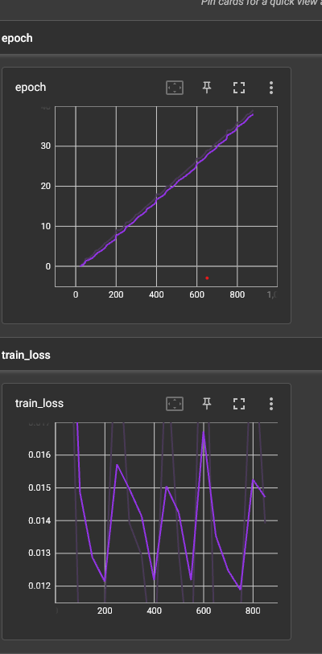
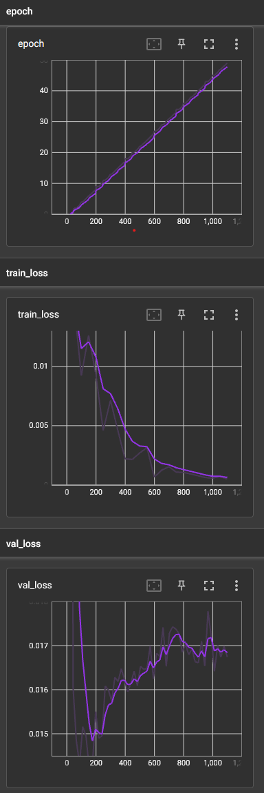
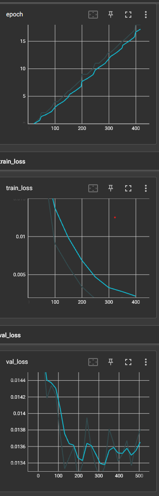
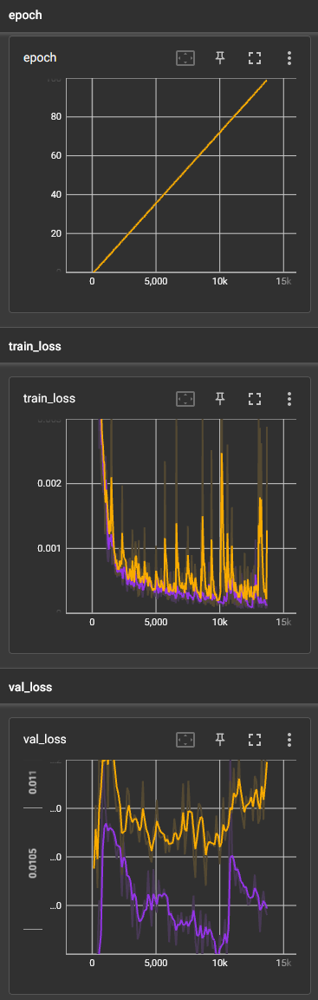
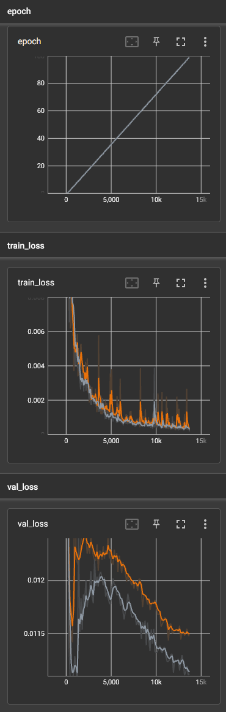
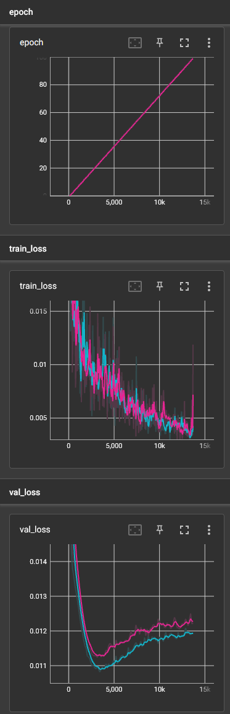
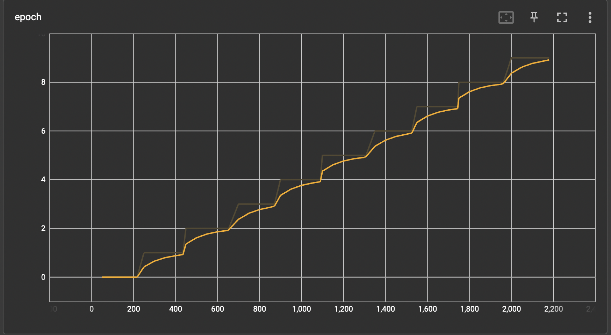
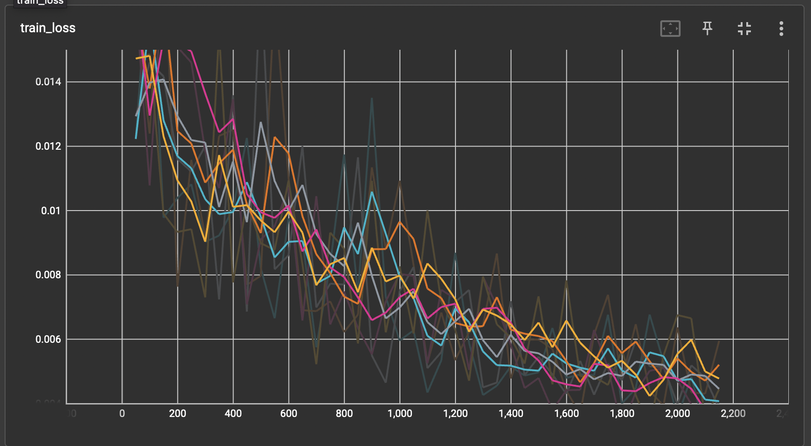
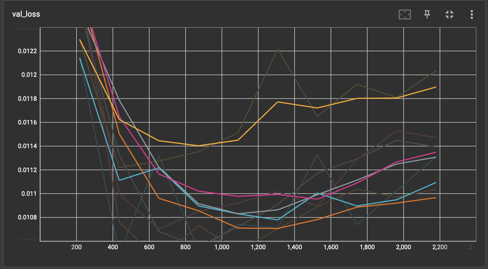

# Course Project

- Name: Sam Silver
- Email: sam55silver@gmail.com
- Course: COMP 444 Machine Learning

## Motivation

With many text-prompt AI applications popping up around the internet, I was compelled to build my own. An example of this text-to-something applications would be DALL-E, a text-to-image AI model. This model is able to take the english language and expand it to other realm's of creativity. The ability to express creativity through AI and the english language amazed me, I had to build my own.

Throughout the course I have been working with datasets made from spotify's long list of music. I have come to be very familiar with this data and that ultimately lead me to my final course project goal - a text-to-playlist application. This application would give users the ability to express themselves creativity through AI and the english language.

By the end of this project I hoped to create an application that a user can enter a text prompt that describes a feeling that they wish to have in a playlist. Through the power of machine learning (ML), the user would receive 5 songs that correspond to that prompt, in different words - they would receive a playlist which corresponds to their prompt. I went through a couple iterations to achieve this goal, in the end I was able to create an application I am proud of. This project made me compelled to continue education on ML and develop more applications which I hope to someday deploy into production.

## References

1. https://developer.spotify.com/documentation/web-api/reference/get-several-audio-features
2. BERT Paper: https://arxiv.org/pdf/1810.04805.pdf
3. DistilBERT Paper: https://arxiv.org/pdf/1910.01108.pdf
4. https://en.wikipedia.org/wiki/Mean_squared_error

# Q1. Summary

1. Collected my own dataset for supervised machine learning through the use of a large dataset and api calls
2. Created a machine learning pipeline with a NLP model, and hybrid DL + ML model to create a text-to-playlist application for a user to enter in a descriptive input and receive 5 recommended songs as output
3. Used a NLP model (distilBERT) to process playlist descriptions into word embeddings
4. Implemented a Deep Learning model to learn the relation between word embeddings and audio features of a playlist
5. Used k-fold cross validation to train multiple models to obtain the most accurate model
6. Created a prediction mode which passes a prompt input through a DL + ML hybrid model that provides a playlist of 5 songs

# Q2. Dataset Description

I chose the spotify million playlist dataset from: https://www.aicrowd.com/challenges/spotify-million-playlist-dataset-challenge

This dataset holds a million playlists each with a list of tracks. I chose this dataset as I am able to associate certain lists of tracks to certain word meanings effectively creating a text-to-playlist like application. luckily, this dataset has lots of playlist data and seemed to be a perfect for such an application.

My samples of interest in this playlist are only the playlists with descriptions. the majority of the playlists in this dataset only have playlist names.

- All playlists: 1000000
- Playlists with only names: 981240
- Playlists with descriptions: 18760

The reason I opted for using only playlists with descriptions was because of the names that were being used for the playlists. A lot of the names were just emojis and also very short in length. Meanwhile, descriptions had a lot more descriptive wording and also more character length. As I hoped my application would be used by entering a description for a feeling of a playlist like: "I want to have a playlist were I can rock out while working out" or "I am feeling like floating on a cloud". I wanted more descriptive word embeddings to be associated with each list of tracks to allow for more descriptive text-to-playlist use.

- Playlists with just emojis as the name: 977471
- Average playlist name word length: 1.43
- Average playlist description word length: 8.12

For the features, the playlists had a lot of useless features for the use of this application, here they are:

- name
- collaborative
- pid
- modified_at
- num_tracks
- num_albums
- num_followers
- tracks
- num_edits
- duration_ms
- num_artists
- description

The only columns of interest to me is the description of the playlist and the lists tracks for each playlist. Within the tracks list there is some more data, here is the following features for each track:

- pos
- artist_name
- track_uri
- artist_uri
- track_name
- album_uri
- duration_ms
- album_name

The features for each track also does not tell us much, however, each track has a track_uri. Luckily, this track_uri gives us much more access to even more data regarding the track. Spotify has an audio feature API which you can call along with an ID of a track to retrieve audio features of that track, down below are the audio features you can retrieve:

- acousticness
- analysis_url
- danceability
- duration_ms
- energy
- id
- instrumentalness
- key
- liveness
- loudness
- mode
- speechiness
- tempo
- time_signature
- track_href
- type
- uri
- valence

The features that matter to us is: acousticness, danceability, energy, instrumentalness, liveness, loudness, speechiness, tempo, and valence. All these values represent the distinct sound of each song and will give the DL model the best representation of a word embedding to a song. All of these values, besides loudness and tempo, all range from 0-1, an already appropriate value for a DL model. For loudness and temp they are a large range, values that I will have to normalize before entering into a DL model. In order to retrieve all of these audio features I must create my own dataset. This problem leads into question 3 to talk about how I did this and how I used this new dataset to achieve my goal of text-to-playlist.

# Q3. Details

## 1. Collected my own dataset for supervised machine learning through the use of a large dataset and api calls

Using the playlist dataset as a starting point, I parsed through the dataset and collected only what was needed - playlists with descriptions, descriptions with no symbols, and also the tracks of each playlist. In the tracks of each playlist I took only the tracks name, artist, and id. With this data, I complied a dictionary of all the unique tracks of all the playlists combined.

- Unique songs: 186850

Using this dictionary, I collected all the ids in an array. The spotify API allows for 100 songs (100 ids) per request (1). I split the array into chunks of 100 ids and passed them through a request call. Through the request I get all the audio features I need mentioned above in my data description. Once retrieved, I normalize loudness and tempo as these are the only features that are not between 0, and 1. With this data compiled, I created a data frame of each track with their name, id, artist, uri, and 9 audio features.

Before training I pre-process all this data by looping through each playlist, each having a list of ids that correspond to tracks in that playlist. I use these ids to retrieve the track from the audio_features_dataset which is the collection of all unique songs and their audio features. Once each track for a playlist is collected I get the average of each audio features from the tracks, this leads to each playlist having 9 audio features and a description. This is where I want the data and now I can train a model on this data.

Looking deeper into what this final dataset stats are here is a pandas describe function ran on the data:

| Audio Feature | danceability | energy | loudness | speechiness | acousticness | instrumentalness | liveness | valence | tempo |
| :------------ | -----------: | -----: | -------: | ----------: | -----------: | ---------------: | -------: | ------: | ----: |
| count         |        10896 |  10896 |    10896 |       10896 |        10896 |            10896 |    10896 |   10896 | 10896 |
| mean          |        0.588 |  0.609 |    0.685 |       0.088 |         0.28 |            0.087 |    0.182 |   0.465 | 0.426 |
| std           |        0.097 |  0.144 |    0.094 |        0.05 |         0.19 |            0.159 |    0.038 |   0.131 | 0.056 |
| min           |        0.069 |  0.053 |    0.147 |       0.024 |            0 |                0 |    0.075 |   0.012 | 0.159 |
| 25%           |         0.53 |  0.529 |    0.633 |       0.052 |        0.142 |            0.006 |    0.159 |   0.384 | 0.392 |
| 50%           |        0.591 |  0.628 |    0.695 |       0.072 |        0.224 |            0.027 |    0.179 |   0.464 | 0.424 |
| 75%           |        0.653 |  0.709 |    0.752 |       0.105 |        0.375 |            0.087 |    0.201 |   0.552 | 0.457 |
| max           |        0.851 |  0.967 |    0.922 |       0.815 |        0.987 |            0.928 |    0.665 |   0.926 | 0.883 |

The biggest takeaway from these stats are the range of numbers, the majority never go above 0.9 and never go below 0.1, this range of = 0.1-0.9 is very different from my original thought of the range being 0-1. This knowledge will come in handy later when I am building the architecture of my DL model.

## 2. Created a machine learning pipeline with a NLP model, and hybrid DL + ML model to create a text-to-playlist application for a user to enter in a descriptive input and receive 5 recommended songs as output

I am first going to give a brief overview of the whole ML pipeline before I go into the specifics of each section, hopefully this will give context to why I make certain decisions at different points of the pipeline. The goal of the project is for a user to give the model a prompt in the form of a string, the model will parse that input and output 5 songs that are recommended for that playlist. The model must first parse the input, and put it into a word embedding. It does this using the distilled bert pre-trained nlp model - the string is tokenized and then passed through the pre-trained model. The model produces a word embedding which can be interpreted by the DL model. This word embedding is passed to a feed forward regressor model which is trained on 18760 samples of word embeddings as the X (data) and averaged audio features as the Y (labels). This model outputs the 9 predicted audio features for the prompt. This output is then put through a KNN with the mahalanobis distance function to determine the 5 songs that are closets to the outputted audio features.

This model is flexible in what dataset is used to choose the 5 recommended songs for the user. The dataset only requires to have the 9 audio features of each song, the name, artist name and uri of track. In this project I use the collection of all the unique songs gathered from the spotify API requests. This dataset provides many tracks (186850 tracks) to choose from allowing for the KNN model to have a large selection. This dataset could be replaced with a more recent track list (The tracks within my current dataset are only from 2017 and down) making this model very flexible for production use.

## 3. Used a NLP model (distilBERT) to process playlist descriptions into word embeddings

I chose the distilBERT model from Hugging Face to tokenize and train my word embeddings along side my audio features. This base model has 110 million parameters (2) resulting in very powerful model for retrieving meaning out of small sentences of which I am working with for my dataset. Using a pre-trained model for my NLP allows me to focus more heavily on the regressor DL model and prediction mode which was my hope at the start of the project to be able to have users use the model to predict playlists.

Originally I used the BERT model for the NLP model, this however lead to a lot of over fitting. The BERT model has 110 million parameters (2), this is 40% more then the distilBERT (3). A model of this size was overpowering my architecture within my deep learning model and simple word descriptions making the model over fit and produce the same result with a small variance on a wide range of prompts with different sentiments. Hugging Face declares that the distilBERT model is still 97% as powerful as the bert model which made me incline to try to use the model in my pipeline. This ultimately helped with over fitting due to the decrease in parameter size.

## 4. Implemented a Deep Learning model to learn the relation between word embeddings and audio features of a playlist

### Acknowledgement

Before discussing how I implemented the model and the quirks I had to iron out with it, I would like to thank Derek Berger. Derek helped with and taught me a lot of this portion of the project, how to implement this model and how to reason with the errors that occurred during the training. He was able to point me in the right direction while furthering my understanding of this courses topic. He helped me fully realize the potential of this project and for that I thank him.

### Content

Implementing the deep learning regressor model was the biggest portion of this project. I went through many iterations of my architecture to get to a point where I was happy. The main idea of the model is to take tokenized words and turn them into word embeddings within the pre-trained distilBERT model and then pass the word embeddings to a regressor model to match the embeddings with the audio features. My original architecture looked like this:

```
        self.regressor = nn.Sequential(
            nn.Linear(input_size, 256),
            nn.ReLU(),
            nn.Linear(256, 256),
            nn.ReLU(),
            nn.Linear(256, output_size),
        )
```

This architecture made the model over-fit, any prediction I did was around the same values (only 0.001 difference). To dissect what was going wrong I viewed my train loss logs to reveal:



The train loss graphed a Cyclical pattern indicating I forgot to shuffle my data. After a shuffle of my data within my train dataloader, I was getting regular graphs. My train loss however was steadily decreasing why my validation loss was steadily increasing. This represented that I still had over fitting on my hands:



From here I though that my data could be prone to over-fitting so I decided to explore my data further. As mentioned in the description of my data, most of my data is between 0.1-0.9 and not the original thought of 0-1, here is the table of my data's description again:

| Audio Feature | danceability | energy | loudness | speechiness | acousticness | instrumentalness | liveness | valence | tempo |
| :------------ | -----------: | -----: | -------: | ----------: | -----------: | ---------------: | -------: | ------: | ----: |
| count         |        10896 |  10896 |    10896 |       10896 |        10896 |            10896 |    10896 |   10896 | 10896 |
| mean          |        0.588 |  0.609 |    0.685 |       0.088 |         0.28 |            0.087 |    0.182 |   0.465 | 0.426 |
| std           |        0.097 |  0.144 |    0.094 |        0.05 |         0.19 |            0.159 |    0.038 |   0.131 | 0.056 |
| min           |        0.069 |  0.053 |    0.147 |       0.024 |            0 |                0 |    0.075 |   0.012 | 0.159 |
| 25%           |         0.53 |  0.529 |    0.633 |       0.052 |        0.142 |            0.006 |    0.159 |   0.384 | 0.392 |
| 50%           |        0.591 |  0.628 |    0.695 |       0.072 |        0.224 |            0.027 |    0.179 |   0.464 | 0.424 |
| 75%           |        0.653 |  0.709 |    0.752 |       0.105 |        0.375 |            0.087 |    0.201 |   0.552 | 0.457 |
| max           |        0.851 |  0.967 |    0.922 |       0.815 |        0.987 |            0.928 |    0.665 |   0.926 | 0.883 |

Since my data is between 0.1-0.9 and continuous I can use the sigmoid activation function at the final layer of my architecture to squeeze all of my data between these points.

Also with further discussion with the course's TA, Derek Berger, a bias is also useful to add onto the final layer of a regressor model.

With these two changes my architecture then looked like this:

```
        self.regressor = nn.Sequential(
            nn.Linear(input_size, 32),
            nn.LeakyReLU(),
            nn.Linear(32, output_size, bias=True),
            nn.Sigmoid(),
        )
```

This model stopped the over fitting! The train loss and val loss were both declining:



There however still was further work to be done as there was some Cyclical patterns on the validation loss graph. After more consideration of what was over fitting the model, the power of the BERT nlp model came into mind. With the still massive nlp model with distilBERT behind the regressor model, it did not make sense to have multiple layers to the regressor model, thus I shrunk it to the simplified version of:

```
        self.nlp_model = AutoModel.from_pretrained(nlp_model_name)

        self.regressor = nn.Sequential(
            nn.Linear(input_size, output_size, bias=True),
            nn.Sigmoid(),
        )
```

This architecture ultimately reduced the cyclical pattern and reduce the val_loss even further then before. With over fitting reduced, it was time to play with some knobs of the model to get the lowest possible error rate. The main knobs I focused on where located in the Adam optimizer of the model. I cycled through a couple iterations of learning rates and weight decay. With a massive nlp model in my architecture I was unsure of what learning rate to choose so I decided to try a couple and utilize the one that was the most effective. I also used weight decay to try to minimize over-fitting further as the cyclical pattern of val loss was still present and has potential to be reduced further. here are the values I tested with:

| Knob          | Run 1 | Run 2 | Run 3 |
| :------------ | ----: | ----: | ----: |
| Learning Rate |  1e-4 |  1e-5 |  1e-6 |
| Weight Decay  |  1e-4 |  1e-3 |  1e-2 |

To see the tests in actions see the next question where I talk about how I train and test my models with k-fold cross validation.

## 5. Used k-fold cross validation to train multiple models to obtain the most accurate model

In order to train and test the models I used k-fold cross validation to split the data into folds to train and test on. Once training and test data has been split, validation data is split from the training data. Once the model is trained and validated on the split data, it is then tested with test data. The test I chose was the Mean Squared Error (MSE) test as it is very useful when testing regressor models, the prediction may not be exactly the same as the true value but it may be very close, and that is still a good prediction. MSE is great at quantifying the difference between the predictions and the true values (4). This allows me to see how well my model is predicting audio features by taking into account how close every prediction is to the true value. Within the tests a lower MSE value is more beneficial. Through each run I list the learning rate, weight decay, train loss and validation loss graphs and also the MSE values for the 2 folds that I chose to run for each training set.

### Run 1

- learning Rate = 1e-4
- Weight Decay = 1e-4



| fold |       mse |
| :--- | --------: |
| 1    | 0.0109939 |
| 2    | 0.0112446 |

### Run 2

- learning Rate = 1e-5
- Weight Decay = 1e-3



| fold |       mse |
| :--- | --------: |
| 1    | 0.0121586 |
| 2    |  0.012014 |

### Run 3

- learning Rate = 1e-6
- Weight Decay = 1e-2



| fold |       mse |
| :--- | --------: |
| 1    | 0.0109523 |
| 2    | 0.0114804 |

### Analysis

Run 2 showed significantly better results out of the other runs. It showed over all lower val_loss score, lower MSE values and a more consistent downward trending val_loss curve. These stats show that the model with these parameters are over all better at not over-fitting and predicting the best audio features for a particular prompt.

As the the val_loss curve seems to still be trending downward even at the end of training I would have liked to train these values on a higher amount of epochs to see how low I could get my val_loss. Sadly, nearing the end of the project I did not have the time or resources available to train the final run with the amount of epochs I desired. For future work I would like to gain access to more resources to compute such high epochs in a timely matter.

## 6. Created a prediction mode which passes a prompt input through a DL + ML hybrid model that provides a playlist of 5 songs

The final pass through of the ML pipeline is the prediction mode. I used a KNN model along with the mahalanobis distance function in order to collect the closest songs to the output audio features from the Deep learning regressor model. The KNN model is flexible to the predicted song dataset. You could enter in a more up to date set of tracks along with their names, artists names, uri, and audio features and still have the KNN predict 5 songs with a given output from the regressor model.

From my trials above I opted to train my final model with a learning rate of 1e-5 and weight decay of 1e-3. I also chose to train this model on 10 epochs and 5-folds to retrieve the lowest MSE value. Below are the results of the training:

### MSE error rates

| fold |       mse |
| :--- | --------: |
| 1    | 0.0115024 |
| 2    | 0.0112326 |
| 3    | 0.0111743 |
| 4    |  0.010683 |
| 5    | 0.0114798 |

### Train and Validation loss Graphs







### Predictions

I took the final trained model to "production mode" and threw a couple of prompts at it to see the results. The decision behind each prompt was to give the machine different sentiments to see how it handled a wide range of feels.

#### Prompt: "Give me a light and happy playlist"

|     | name                              | artist               | uri                                  |
| --: | :-------------------------------- | :------------------- | :----------------------------------- |
|   0 | You & Me                          | Chief Keef           | spotify:track:4MSUXtxteLFYbVA6pLeb7x |
|   1 | Beauty School Dropout             | Stephen R. Buntrock  | spotify:track:2mPXOOY1ClnraYPrkAb9To |
|   2 | Never Never Let Me Down           | Formulars Dance Band | spotify:track:0I4PBLHKkdlJdk6ltQjv6u |
|   3 | Speakers, Bleachers And Preachers | Brandon Lay          | spotify:track:0Is6MRHWKe7y2xIxDkvO6l |
|   4 | I Think I'll Be Their God         | Ryan Culwell         | spotify:track:2j1MqPxhji70CuWKGIXfVX |

#### Prompt: "I am feeling angry and I want to do a heavy workout"

|     | name                     | artist         | uri                                  |
| --: | :----------------------- | :------------- | :----------------------------------- |
|   0 | Break Up In A Small Town | Sam Hunt       | spotify:track:2N3F1EQCpnIeDOA3rLSAfE |
|   1 | Together - Original Mix  | Maor Levi      | spotify:track:6qe9r3KmyX1wHt36kslMV8 |
|   2 | Bliss                    | Delirious?     | spotify:track:7jx2jMRdj2tBlOQeILv33O |
|   3 | Andy                     | Last Dinosaurs | spotify:track:3Zrfj710ukvJrL0x6EExRj |
|   4 | Me, Myself and Time      | Demi Lovato    | spotify:track:3bL0P5OA5FnWbQLMAGJ1m7 |

#### Prompt: "A cold and rainy day"

|     | name                    | artist       | uri                                  |
| --: | :---------------------- | :----------- | :----------------------------------- |
|   0 | Better                  | Samm Henshaw | spotify:track:5MohUeUMmNiqKlEqQLeTBK |
|   1 | The Only Boy Awake      | Meadows      | spotify:track:4tRt91OQSbE9eFA3RwgqSd |
|   2 | Next Of Kin             | Conor Oberst | spotify:track:1KadGVbHKua1vGuoyOuQtN |
|   3 | Squirrels               | Neva Dinova  | spotify:track:0WE9ZYjWu2akJ419AgqVAC |
|   4 | You're Lost Little Girl | The Doors    | spotify:track:5onlaW8X1ps8VS4DhxpFom |

#### Prompt: "I want to chill out after a long week"

|     | name                        | artist             | uri                                  |
| --: | :-------------------------- | :----------------- | :----------------------------------- |
|   0 | Like I'm Gonna Lose You     | Meghan Trainor     | spotify:track:2YlZnw2ikdb837oKMKjBkW |
|   1 | Special Eyes                | Xavier Omär        | spotify:track:1OklZefA3QDQIocxzTbpRQ |
|   2 | Garden                      | Wilsen             | spotify:track:0Fhm1Jjz3h7bNOeNWr7NzE |
|   3 | What Kind Of Man Would I Be | Mint Condition     | spotify:track:5qR3pYQIC10S7aD2YBjgui |
|   4 | The Line                    | Noah And The Whale | spotify:track:3g6qSPWPmVvHbUGxWKjkCr |

#### Prompt: "Melodic calming music"

|     | name                          | artist           | uri                                  |
| --: | :---------------------------- | :--------------- | :----------------------------------- |
|   0 | Idaho                         | Jeffrey Foucault | spotify:track:1UQtkG8ytLmWn5jl4r0nT1 |
|   1 | Harvest Moon                  | Sunflower Bean   | spotify:track:2uUCCzxbK2oxUMayYqGhdd |
|   2 | Sober                         | Bazzi            | spotify:track:7LdMXgWzLthvxJOngkynaB |
|   3 | Hey Cowboy                    | Lee Hazlewood    | spotify:track:51hGgKi78HDiFBcFNVbet9 |
|   4 | Ain't No Mountain High Enough | Partysingers     | spotify:track:2bIopgkl64QmsmBJQ92WZT |

### Analysis

The prompts gave a widely different playlist for each sentiment. However, some of the tracks that the model chose did not necessarily "suit" the prompt. The first prompt was, "give me a light and happy playlist" and it chose "You & Me" by chief Keef for the first song. Some humans may say this is not quite a light and happy song.

Preference of music plays a big part on what prompt is correct or not. I may not necessarily think that "Like I'm Gonna Lose You" by Meghan Trainor is a song that "I want to chill out after a long week" to. My friend on the the other hand who likes Meghan Trainor does think that is a chill song that they would like to chill out to after a long week. This difference in music preference changes what kind of music should be recommended based on the user using the machine. This introduces a whole new aspect to the project, something that I would like to look into in the future. Some ideas I have to add it to this architecture is maybe some human feedback reinforcement learning to the model so users may tell the machine when the output that was produced was not quite right. Another idea is taking the users spotify ID before a prompt. Using the users ID one could get the top played tracks the user listens to. This list and their audio features could be passed into the KNN predict model of the machine. This would mean that the machine would choose the closets songs to the predicted audio features based on the users favorite songs which would ultimately account for their music taste.

## Conclusion

Overall this project taught me how to identify when a model is over-fitting and the steps to take in order to solve the problem. I was successful in creating a text-to-playlist application which takes a prompt from a user and outputs 5 recommended songs for that feeling. For future work I would like to implement user based predictions where the machine would take into account what the music preferences are of the user. I would also like to implement a graphical interface where users could enter their prompt into a website and received a graphically pleasing representation of the songs that are given to them.
